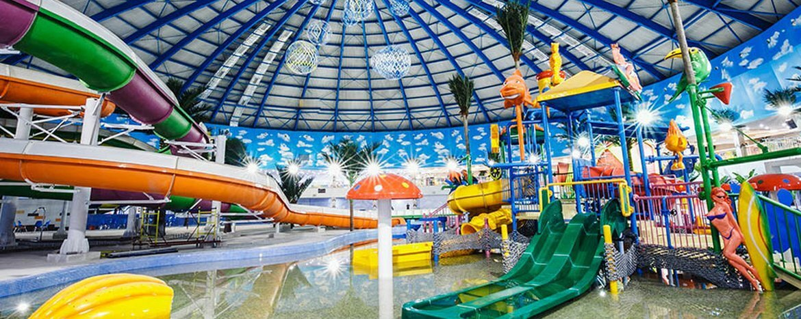

# Mywebsite

## Введение

**Mywebsite** - это интерактивный каталог заведений, разделенных по категориям. Проект ориентирован на удобство пользователей и визуальную привлекательность. Основная цель - предоставить простой и интуитивно понятный интерфейс для поиска заведений.

## Описание проекта

Данный веб-сайт позволяет пользователям фильтровать заведения по категориям, таким как:

- **Рестораны**
- **Кафе**
- **Музеи**
- **Бассейны**

Каждое заведение представлено в виде карточки с информацией о нем. Реализован минималистичный дизайн с акцентами на синие кнопки и светлую цветовую схему.

## Технические детали

### 1. Стилизация
- Встроенные **CSS-стили**, оформленные в светлой цветовой гамме с акцентом на удобочитаемость.

### 2. Фильтрация
- Кнопки в верхней части страницы позволяют отображать только заведения выбранного типа.

### 3. Карточки заведений
Каждое заведение представлено в формате `.place-card`, содержащем:
- 📌 **Фото, название и часы работы** на лицевой стороне.
- 📌 **Краткое описание** на обратной стороне.

### 4. Эффект переворота карточек
- Используется `transform: rotateY(180deg)` для **плавного переворота** при наведении.

### 5. Адаптивность
- Карточки выстраиваются в ряд с помощью:
  ```css
  display: flex;
  flex-wrap: wrap;

**Ссылка на сайт:** [Mywebsite](https://maks232007.github.io/Mywebsite/)

